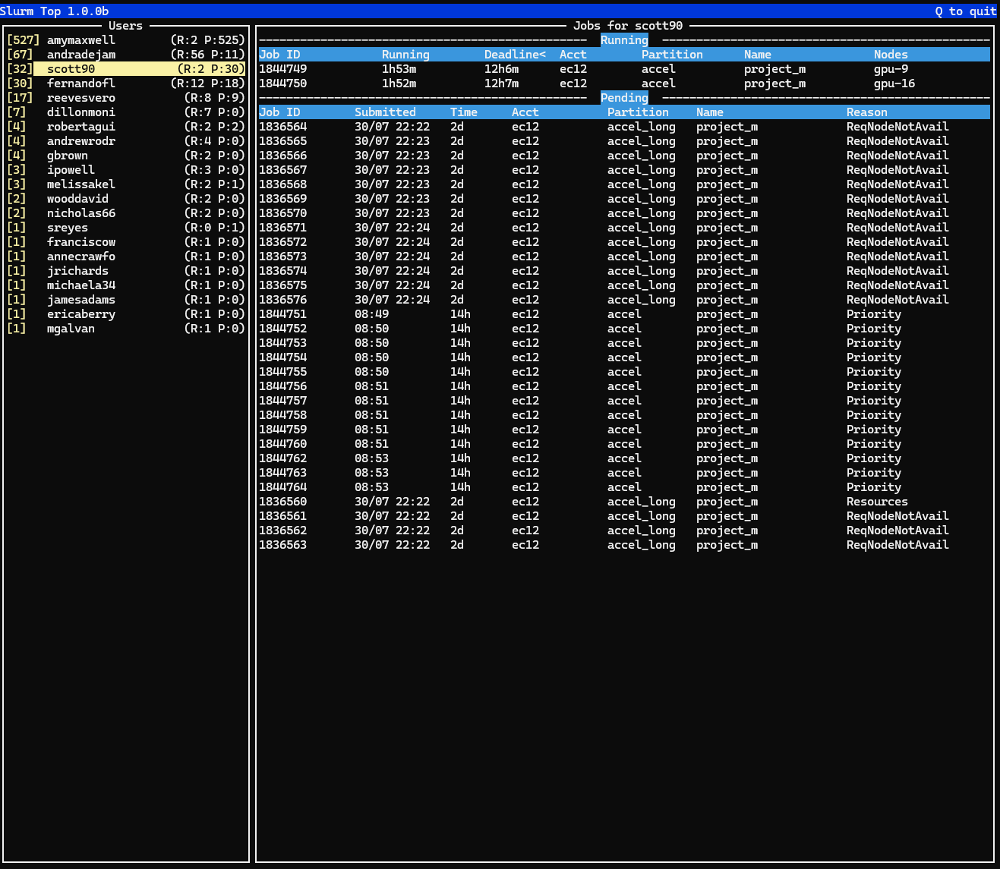

# slop
A `top`-like utility for the Slurm HPC batch job scheduler

# dependencies and requirements

Uses [Urwid](https://urwid.org) to build the TUI.
Runs on any host with `scontrol` set up.



# install/run locally

```
python -m venv slop
source slop/bin/activate
git clone https://github.com/buzh/slop
cd slop
pip install -r slop/requirements.txt
python -m slop.main
```

# how to install globally

You can build a standalone binary with a tool such as `pyinstaller`.
Clone the repo, create venv and install deps as above, then:

```
pip install pyinstaller
pyinstaller --onefile slop/main.py
cp dist/main /somewhere/in/path  # "main" is the resulting binary
```
