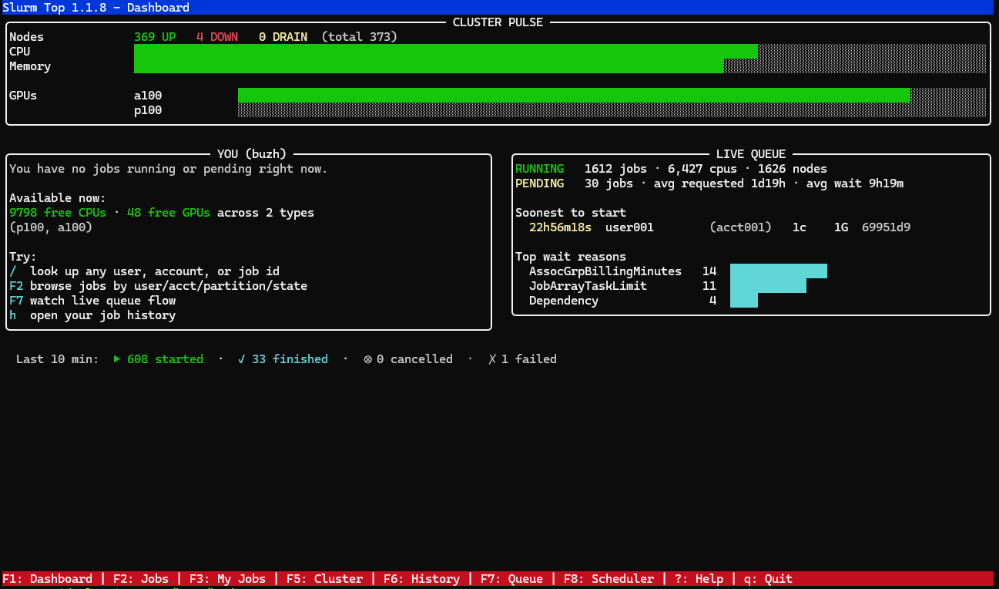
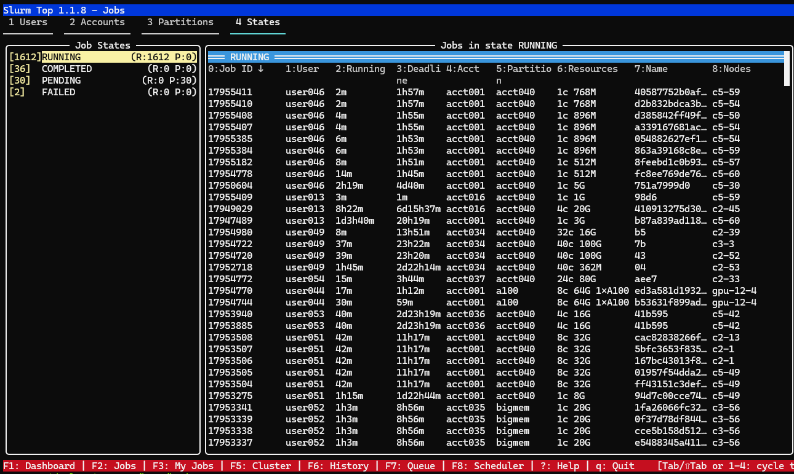
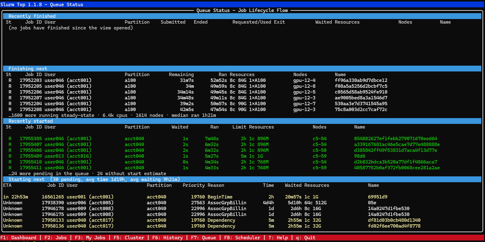
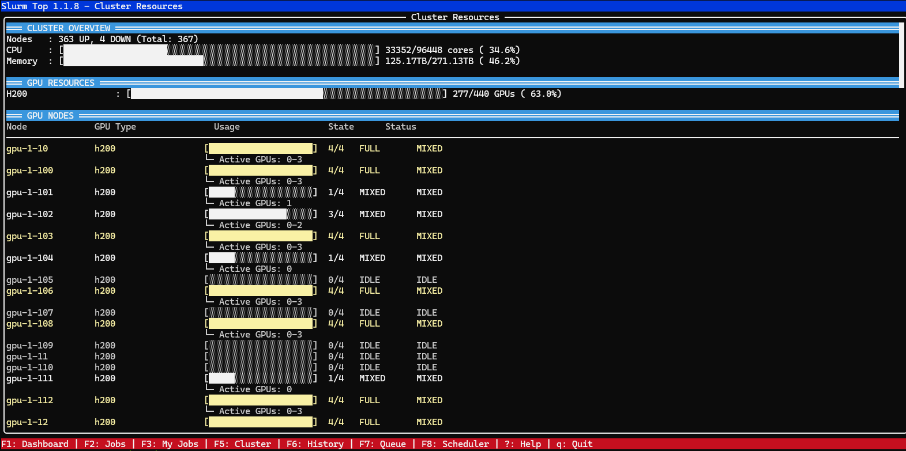
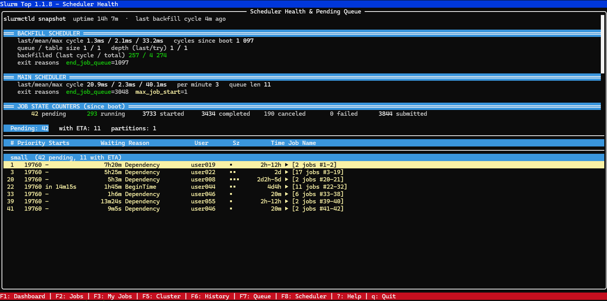
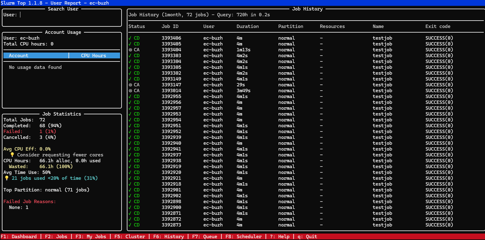

<p align="center">
  
</p>

<h1 align="center">slop</h1>
<p align="center"><i>A <code>top</code>-like utility for the Slurm HPC batch job scheduler</i></p>

---

## Index

- [Features](#features)
- [Screenshots](#screenshots)
- [Installation](#installation)
- [Packages](#packages)
- [Changelog](#changelog)

---

## Features

- **`top`-like TUI** for Slurm — realtime views of jobs, users, accounts and cluster health
- **Views:**
  - *Dashboard* - Cluster and job overview at a glance
  - *My Jobs* — your current jobs and personal history
  - *Users / Accounts / Partitions / States* — No more staring at `squeue` output, find what you're looking for in a glance
  - *Cluster* — Overview of resources and usage, as well as scheduler priority
  - *Job Flow* — live view of jobs starting and ending, with ETAs for top pending jobs
  - *Report* — comprehensive per-user report with efficiency stats and history
- **Smart search (`/`)** — auto-detects job IDs, nodes, accounts, or users; tab completion and live suggestions
- **Array job awareness** — parents collapse/expand to reveal children, focus is preserved across refreshes
- **Comprehensive user reports** — CPU/time efficiency, wasted hours, time-limit warnings, top failure reasons
- **Adapts queries to minimize load** - If `slurmdbd` is slow to respond, `slop` automatically backs off to reduce database pressure
- **Works anywhere** — no daemon, no privileges, no config files. You just need the default tools that come with slurm

## Screenshots

<details>
<summary>Click to expand screenshots</summary>

<br/>

<p align="center">
  
</p>

<p align="center">
  
</p>

<p align="center">
  
</p>

<p align="center">
  
</p>

<p align="center">
  
</p>

<p align="center">
  
</p>

</details>

## Installation

### Dependencies and requirements

- Slurm >= 25.x with JSON output is explicitly supported. Older versions should work fine (as long as they support JSON), but I'll only fix bugs from 25 and up.
- Python >= 3.9
- [Urwid](https://urwid.org) >= 4.0.0

Any distro or architecture should work just fine, as long as the above is supported.

### Install/run with [uv](https://github.com/astral-sh/uv)

The fastest path. `uv` handles the Python interpreter, the virtualenv, and the dependency for you.

```
# install as a global command
uv tool install git+https://github.com/buzh/slop
slop

# or run one-shot, without installing
uvx --from git+https://github.com/buzh/slop slop
```

To upgrade later: `uv tool upgrade slop`. To remove: `uv tool uninstall slop`.

### Install/run locally

```
python -m venv slop_venv
source slop_venv/bin/activate
git clone https://github.com/buzh/slop
cd slop
pip install -r slop/requirements.txt
python -m slop.main
```

### Install globally

You can build a standalone binary with a tool such as `pyinstaller`.
Clone the repo, create the venv and install deps as above, then:

```
pip install pyinstaller
pyinstaller --collect-all=urwid --onefile slop/main.py -n slop
cp dist/slop /somewhere/in/path  # "slop" is the resulting binary
```

## Packages

### RPM

Pre-built x86_64 RPMs are available on the [Releases](https://github.com/buzh/slop/releases) page. Other architectures might be added in the future.

### DEB

I currently don't build `.deb` packages, but if popular demand arises I'll look into it.

## Changelog

See [CHANGELOG.md](CHANGELOG.md).

---

Comments or feedback is highly appreciated, especially bug or crash reports. Even a "this works on my cluster" is helpful, since I only have access to so many systems — and there are many ways to configure Slurm.

<p align="center">
  
</p>

<h3 align="center">Enjoy slop! &mdash; it's highly addictive!</h3>
